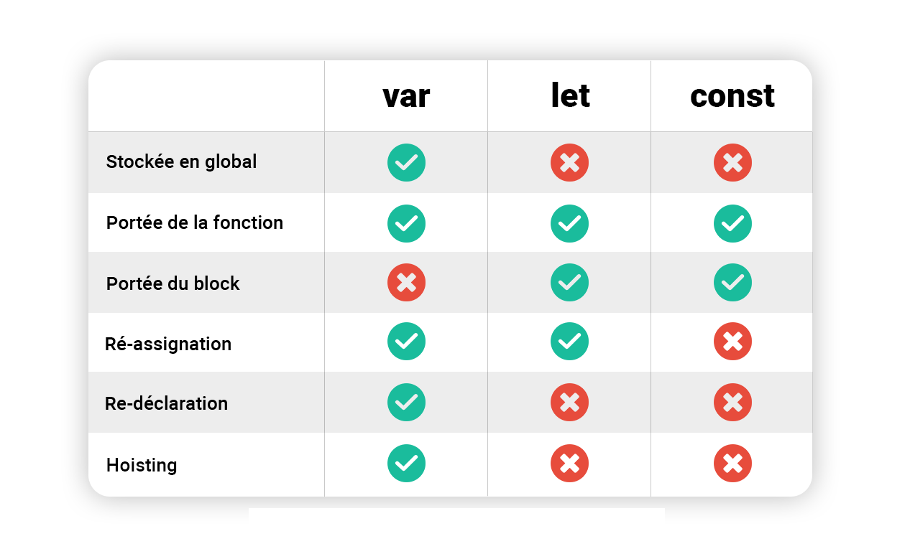

# JavaScript Fondamentales, Pt. 1

## Table des matières

- [Hello World!](#Hello-World!)
- [Variables et Valeurs](#Variables-et-Valeurs)
- [Les Types de Données](#Les-Types-de-Données)
- [let, const and var](#let,-const-and-var)
- [Les Opérateurs Basics](#Les-Opérateurs-Basics)
- [Précédence des Opérateurs](#Précédence-des-Opérateurs)
- [Les Templates Literals](#Les-Templates-Literals)
- [La Condition If / Else](#La-Condition-If-/-Else)
- [La Conversion et Coercion de typage](#La-Conversion-et-Coercion-de-typage)
- [Les Valeurs True et False](#Les-Valeurs-True-et-False)
- [Les Opérateurs d'égalité](#Les-Opérateurs-d'égalité)
- [La Logique Booléenne](#La-Logique-Booléenne)
- [Les Opérateurs Logique](#Les-Opérateurs-Logique)
- [La Condition Switch](#La-Condition-Switch)
- [Les Opérateurs Ternaires](#Les-Opérateurs-Ternaires)

## Hello World!

```js
// Windows Alert
alert("Hello World!");

// Console
console.log("Hello World!"); // 'Hello World!'

// Variable js avec valeur "Incroyable"
let js = "Incroyable";

// Réassignation de la variable js
js = "C'est chiant à mourir mec";

// Condition If avec opérateur d'égalité parfaite
if (js === "C'est chiant à mourir mec") {
  console.log("Mais je continue quand même"); // 'Mais je continue quand même'
}
```

## Variables et Valeurs

- On utilise le **camelCase** pour nommer une variable en JS.
- On ne peut pas utiliser d'autres caractères que les lettres, des chiffres, des traits de soulignement ou le signe dollar.
- On ne déclare **jamais** une variable par un chiffre.
- Les keywords "this", "new", "break", "class", "final", "eval" et bien d'autres sont des keywords réservés par JavaScript.

```js
// Commence par un chiffre
let 420blazeIt = 'Fume, Fume' // Error

// Illegal Character
let blaze&It = 420 // Error

// Reserved Keywords
let new = 'Roule, Roule' // Error
```

```js
// On déclare une variable prénom de valeur "Mathys"
let prenom = "Mathys";

// Renvoie la valeur de la variable prénom
console.log(prenom); // "Mathys"

// On réassigne à la variable prénom la valeur "Bob"
prenom = "Bob";
console.log(prenom); // "Bob"

// On déclare une constante en majuscule
let PI = 3.1415;
```

## Les Types de Données

### Différences entre un Objects et une Primitive

Une valeur peut être de deux catégories:

- **Object**

```js
let me = {
  name: "Mathys",
  age: 25,
};
```

- **Primitive**: Composée de 7 types de données

```js
let prenom = "Mathys;
let age = 25;
```

**Une valeur est primitive que lorsqu'elle n'est pas un object.**

### Les 7 données **Primitive**

**JavaScript a un typage dynamique** : nous n'avons pas à définir manuellement le type de données de la valeur stockée dans une variable.
Au lieu de cela, **les types de données sont déterminés automatiquement**.

- **Number**: Nombre entier ou décimal.
  > Pour les entiers et les décimaux.
- **String**: Séquence de caractères.
  > Pour le texte.
- **Booléen**: Type logique de valeur True ou False
  > Pour la prise de décision
- **Undefined**: Variable déclarée mais sans valeur (valeur vide).
- **Null**: Valeur d'affectation qui signie "Pas de Valeur". Il est du type Object.
- **Symbol**: Valeur unique qui ne peut être changée.
- **BigInt**: Contient un entier plus large que ce que peut contenir **Number**.

### TypeOf

Pour connaître le type de donnée d'une valeur on utilise le keyword:

> typeof

```js
let booleanValue = true;
console.log(typeof booleanValue); // boolean
console.log(typeof 25); // number
console.log(typeof "Mathys"); // string
```

## let, const and var

Lors de la déclaration d'une variable, on privilégie d'abord **const**, puis **let** et enfin **var** (var est de moins en moins utilisé)

### La déclaration let

La déclaration **let** permet de déclarer une variable dont la portée est celle du bloc courant, éventuellement en initialisant sa valeur.

```js
let anneeNaissance;
anneeNaissance = 1997;
console.log(anneeNaissance); // 1997
```

### La déclaration const

La déclaration **const** permet de créer une constante nommée accessible uniquement en lecture. Cela ne signifie pas que la valeur contenue est immuable, uniquement que **l'identifiant ne peut pas être réaffecté.**

> On doit obligatoirement initialiser une valeur à une variable const.

```js
const anneeNaissance = 1997;
anneeNaissance = 1996; // Error
```

### La déclaration var

La déclaration **var**, permet de définir une variable globale ou locale à une fonction (sans distinction des blocs utilisés dans la fonction).

> La portée d'une variable déclarée avec var est le contexte d'exécution courant

#### En résumé



## Les Opérateurs Basics

### Opérateurs d'affectation

Un opérateur d'affectation assigne une valeur à son opérande gauche, valeur basée sur celle de l'opérande droit.

- Affectation après addition

```js
x = x + y;
x += y;
```

- Affectation après soustraction

```js
x = x - y;
x -= y;
```

- Affectation après multiplication

```js
x = x * y;
x *= y;
```

- Affectation après division

```js
x = x / y;
x /= y;
```

- Affectation du reste

```js
x = x % y;
x %= y;
```

### Opérateurs de comparaison

Un opérateur de comparaison compare ses deux opérandes et renvoie un valeur booléenne correspondant au résultat de la comparaison (vraie ou fausse). Les opérandes peuvent être des nombres, des chaînes de caractères, des booléens ou des objets.

- Égalité (==)
  > Renvoie true si les opérandes sont égaux après conversion en valeurs de mêmes types.

```js
let value1 = 3;
let value2 = "3";
console.log(value1 == value2); // True
```

- Inégalité (!=)
  > Renvoie true si les opérandes sont différents.

```js
let value1 = 4;
let value2 = "3";
console.log(value1 != value2); // True
```

- Égalité parfaite/stricte (===)
  > Renvoie true si les opérandes sont égaux et de même type.

```js
let value1 = 3;
let value2 = 3;
console.log(value1 === value2); // True
```

- Inégalité stricte (!=)
  > Renvoie true si les opérandes ne sont pas égaux ou s'ils ne sont pas de même type.

```js
let value1 = 3;
let value2 = "3";
console.log(value1 !== value2); // True
```

- Supériorité stricte (>)
  > Renvoie true si l'opérande gauche est supérieur (strictement) à l'opérande droit.

```js
let value1 = 5;
let value2 = "3";
console.log(value1 > value2); // True
```

- Supériorité ou égalité (>=)
  > Renvoie true si l'opérande gauche est supérieur ou égal à l'opérande droit.

```js
let value1 = 3;
let value2 = "3";
console.log(value1 >= value2); // True
```

- Infériorité stricte (<)
  > Renvoie true si l'opérande gauche est inférieur (strictement) à l'opérande droit.

```js
let value1 = 3;
let value2 = "5";
console.log(value1 < value2); // True
```

- Infériorité ou égalité (<=)
  > Renvoie true si l'opérande gauche est inférieur ou égal à l'opérande droit.

```js
let value1 = 3;
let value2 = "3";
console.log(value1 <= value2); // True
```

### Opérateurs arithmétiques

Les opérateurs arithmétiques ont pour opérandes des valeurs numériques (des littéraux ou des variables) et renvoient une valeur numérique.

- Reste (%)
  > Renvoie le reste entier de la division entre les deux opérandes.

```js
let value1 = 12;
let value2 = 5;
console.log(value1 % value2); // 2
```

- Incrément (++)
  > Ajoute un à son opérande.

```js
let value1 = 3;
let value2 = 3;
++value1;
value2++;
console.log(value1); // 4
console.log(value2); // 4
```

- Décrément (--)
  > Soustrait un à son opérande.

```js
let value1 = 3;
let value2 = 3;
--value1;
value2--;
console.log(value1); // 2
console.log(value2); // 2
```

- Négation unaire (-)
  > Renvoie la valeur opposée de l'opérande.

```js
let value1 = 3;
console.log(-value1); // -3
```

- Plus unaire (+)
  > Si l'opérande n'est pas un nombre, il tente de le convertir en une valeur numérique.

```js
let value1 = +"3";
let value2 = +true;
console.log(value1); // number 3
console.log(value2); // 1
```

- Opérateur d'exponentiation (\*\*) (puissance)
  > Calcule un nombre (base) élevé à une puissance donnée (soit base^puissance)

```js
let value1 = 3;
let value2 = 5;
let total = value1 ** value2;
console.log(total); // 243
```

## Précédence des Opérateurs

## Les Templates Literals

## La Condition If / Else

## La Conversion et Coercion de typage

## Les Valeurs True et False

## Les Opérateurs d'égalité

## La Logique Booléenne

## Les Opérateurs Logique

## La Condition Switch

## Les Opérateurs Ternaires

```

```

```

```

```

```

```

```
