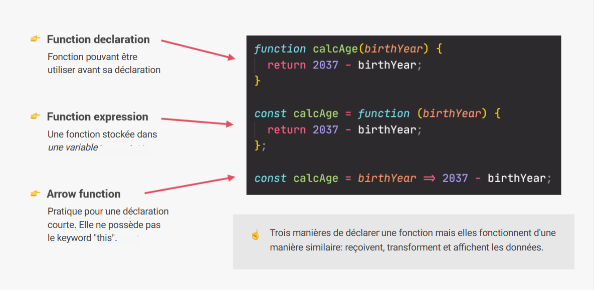
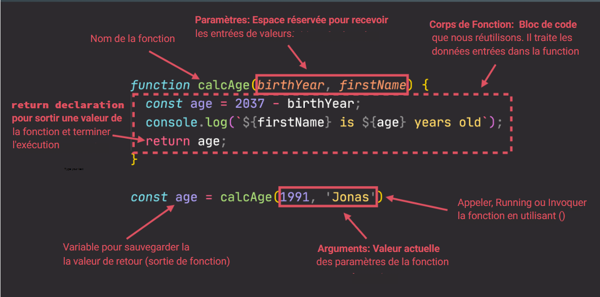

# JavaScript Fondamentales, Pt. 2

## Table des matières

- [Strict Mode](#strict-mode)
  - [Définition du Strict Mode](#définition-du-strict-mode)
  - [A quoi ça sert?](#a-quoi-ça-sert)
  - [Invoquer le Strict Mode](#invoquer-le-strict-mode)
- [Les Fonctions](#les-fonctions)
  - [Définition d'une Fonction](#définition-dune-fonction)
  - [La déclaration de Fonction](#la-déclaration-de-fonction)
    - [Exemple de déclaration de Fonction](#exemple-de-déclaration-de-fonction)
  - [L'expression de Fonction](#lexpression-de-fonction)
    - [Exemple d'expression de Fonction](#exemple-dexpression-de-fonction)
  - [Les Fonctions fléchées](#les-fonctions-fléchées)
    - [Exemple de Fonction fléchée](#exemple-de-fonction-fléchée)
  - [Les Callback de Fonction](#les-callback-de-fonction)
    - [Définition d'une fonction de rappel](#définition-dune-fonction-de-rappel-callback)
      - [Exemple de Callback](#exemple-de-callback)
  - [Résumé des fonctions](#résumé-des-fonctions)
    - [Trois manières de déclarer une fonction](#trois-manières-de-déclarer-une-fonction)
    - [Anatomie d'une fonction](#anatomie-dune-fonction)
- [Les Tableaux](#les-tableaux)

## Strict Mode

### Définition du Strict Mode

Le mode strict de ECMAScript 5 permet de choisir une variante restrictive de JavaScript. Le mode strict n'est pas seulement un sous-ensemble de JavaScript : il possède intentionnellement des sémantiques différentes du code normal.

**Il permet de réaliser des scripts plus sécurisés en évitant les erreurs accidentelles.**

### A quoi ça sert?

**Le mode strict apporte quelques changements à la sémantique « normale » de JavaScript:**

1. Le mode strict élimine quelques erreurs silencieuses de JavaScript en les changeant en erreurs explicites (une exception sera levée).
2. Le mode strict corrige les erreurs qui font qu'autrement il est difficile pour les moteurs JavaScript d'effectuer des optimisations. Le code sera donc exécuté plus rapidement en mode strict, sans changer une seule ligne si cela n'est pas nécessaire.
3. Le mode strict interdit les mot-clés susceptibles d'être définis dans les futures versions de ECMAScript.

### Invoquer le Strict Mode

En début de script ou dans un bloc.

> "use strict";

```js
"use strict";
var v = "Je suis en mode strict !";
```

## Les Fonctions

### Définition d'une Fonction

Les fonctions font partie des briques fondamentales de JavaScript. Une fonction est une procédure JavaScript, un ensemble d'instructions effectuant une tâche ou calculant une valeur. Afin d'utiliser une fonction, il est nécessaire de l'avoir auparavant définie au sein de la portée dans laquelle on souhaite l'appeler.

### La déclaration de Fonction

Une définition de fonction (aussi appelée déclaration de fonction ou instruction de fonction) est construite avec **le mot-clé function**, suivi par :

- Le nom de la fonction.
- Une liste d'arguments à passer à la fonction, entre parenthèses et séparés par des virgules.
- Les instructions JavaScript définissant la fonction, entre accolades, { }.

#### Exemple de déclaration de Fonction

```js
// Déclaration de fonction sous le nom fruitMxer de paramètres (pommes, oranges, bananes)
function fruitMixerDeclaration(pommes, oranges, bananes) {
  console.log(pommes, oranges, bananes);
  const monJuJuOnDaBeat = `Mon Juju avec ${pommes} pomme(s), ${oranges} orange(s) et ${bananes} banane(s).`;
  return monJuJuOnDaBeat;
}

const monJujuDePomme = fruitMixerDeclaration(5, 0, 0);
console.log(monJujuDePomme); // Mon Juju avec 5 pomme(s), 0 orange(s) et 0 banane(s).

const monJujuMultifruit = fruitMixerDeclaration(3, 3, 5);
console.log(monJujuMultifruit); // Mon Juju avec 3 pomme(s), 3 orange(s) et 5 banane(s).
```

### L'expression de Fonction

Une expression de fonction fonctionne exactement comme une déclaration de fonction ou une instruction de fonction, la seule différence est qu’elle est stockée dans une variable et donc qu'il n'y a pas de nom de fonction dans une expression de fonction, **c’est-à-dire que des fonctions anonymes sont créées dans des expressions de fonction**. Les expressions de fonction s’exécutent dès qu’elles sont définies.

**L’omission d’un nom est autorisée pour les fonctions expressions.**

#### Exemple d'expression de Fonction

```js
// Expression de fonction stockée dans la variable fruitMixerExpression de paramètres (pommes, oranges, bananes)
const fruitMixerExpression = function (pommes, oranges, bananes) {
  const monJuJuOnDaBeat = `Mon Juju avec ${pommes} pomme(s), ${oranges} orange(s) et ${bananes} banane(s).`;
  return monJuJuOnDaBeat;
};

const monJujuDePomme = fruitMixerExpression(5, 0, 0);
console.log(monJujuDePomme); // Mon Juju avec 5 pomme(s), 0 orange(s) et 0 banane(s).

const monJujuMultifruit = fruitMixerExpression(3, 3, 5);
console.log(monJujuMultifruit); // Mon Juju avec 3 pomme(s), 3 orange(s) et 5 banane(s).
```

### Les Fonctions fléchées

Une expression de fonction fléchée (arrow function en anglais) permet d’avoir une syntaxe plus courte que les expressions de fonction et **ne possède pas ses propres valeurs pour this, arguments, super, ou new.target**. Les fonctions fléchées sont **souvent anonymes** et ne sont **pas destinées à être utilisées pour déclarer des méthodes**.

#### Exemple de Fonction fléchée

```js
const fruitMixerFlechee = (pommes, oranges, bananes) => {
  const monJuJuOnDaBeat = `Mon Juju avec ${pommes} pomme(s), ${oranges} orange(s) et ${bananes} banane(s).`;
  return monJuJuOnDaBeat;
};

const monJujuDePomme = fruitMixerFlechee(5, 0, 0);
console.log(monJujuDePomme); // Mon Juju avec 5 pomme(s), 0 orange(s) et 0 banane(s).

const monJujuMultifruit = fruitMixerFlechee(3, 3, 5);
console.log(monJujuMultifruit); // Mon Juju avec 3 pomme(s), 3 orange(s) et 5 banane(s).
```

## Les Callback de Fonction

### Définition d'une fonction de rappel (Callback)

Une fonction de rappel (aussi appelée callback en anglais) est une fonction passée dans une autre fonction en tant qu'argument, qui est ensuite invoquée à l'intérieur de la fonction externe pour accomplir une sorte de routine ou d'action.

#### Exemple de Callback

```js
function couperLesFruits(fruit) {
  return fruit * 4;
}

function fruitMixerFlechee(pommes, oranges, bananes) {
  // Callback
  const morceauDePommes = couperLesFruits(pommes);
  const morceauOranges = couperLesFruits(oranges);
  const morceauDeBananes = couperLesFruits(bananes);

  const monJuJuOnDaBeat = `Mon Juju avec ${morceauDePommes} morceaux de pomme(s), ${morceauOranges} morceaux de orange(s) et ${morceauDeBananes} morceaux de banane(s).`;
  return monJuJuOnDaBeat;
}

const monJujuDePomme = fruitMixerFlechee(5, 0, 0);
console.log(monJujuDePomme);
// Mon Juju avec 20 morceaux de pomme(s), 0 morceaux de orange(s) et 0 morceaux de banane(s).

const monJujuMultifruit = fruitMixerFlechee(3, 3, 5);
console.log(monJujuMultifruit);
// Mon Juju avec 12 morceaux de pomme(s), 12 morceaux de orange(s) et 20 morceaux de banane(s).
```

## Résumé des fonctions

### Trois manières de déclarer une fonction



### Anatomie d'une fonction



## Les Tableaux

### Définition d'un Tableau

**Un tableau est un objet contenant plusieurs valeurs.** Les objets tableau peuvent être stockés dans des variables et traités de la même manière que tout autre type de valeur, la différence étant que nous pouvons accéder à chaque valeur du tableau individuellement, et faire des choses super utiles et efficaces avec la liste des valeurs, comme boucler et faire la même chose pour chaque valeur.

### Créer un tableau

On définit les valeurs d'un tableau par une liste d'éléments entre crochets droits, séparés par des virgules.

> let tableau = [];

OU

> let tableau = new Array();

#### Exemple de création de tableau

```js
const prenom = "Mathys";
const ami = ["Toto", "Tati", "Tata"];
const annees = new Array(1997, 1996, 2001, 2002, 2008);
const mathys = [prenom, "Fumery", 2022 - 1997, "développeur", ami];

console.log(ami); // [ 'Toto', 'Tati', 'Tata' ]
console.log(annees); // [ 1997, 1996, 2001, 2002, 2008 ]
console.log(mathys); // [ 'Mathys', 'Fumery', 25, 'développeur', [ 'Toto', 'Tati', 'Tata' ] ]

// Renvoie la valeur d'index[0] et d'index[1] du tableau ami
console.log(ami[0]); // "Toto"
console.log(ami[1]); // "Tati"

// Renvoie la longueur du tableau
console.log(ami.length); // 3 (car 3 éléments)

// Renvoie la valeur d'index[3 - 1] = index[2]
console.log(ami[ami.length - 1]); // Tata

// Remplace la valeur d'index 2 du tableau ami
ami[2] = "Sullivan";
console.log(ami); // [ 'Toto', 'Tati', 'Sullivan' ]

// Accède au tableau ami intégré dans le tableau mathys
console.log(mathys[4]); // [ 'Toto', 'Tati', 'Sullivan' ]

// Accède à la valeur d'index0 du tableau ami intégré dans le tableau Mathys
console.log(mathys[4][0]); // Toto
```

#### Exercice tableaux

Appliquer une fonction calcAge aux valeurs d'index[0], d'index[3] et à la dernière valeur du tableau annees.
Créer un nouveau tableau ageReturn avec le résultat de la fonction calcAge()

```js
const calcAge = function (anneeNaissance) {
  return 2022 - anneeNaissance;
};

const annees = [1997, 1998, 1999, 2000, 2001, 2002];

const age1 = calcAge(annees[0]);
const age2 = calcAge(annees[3]);
const age3 = calcAge(annees[annees.length - 1]);
console.log(age1, age2, age3); // 25 22 20

const ageReturn = [
  calcAge(annees[0]),
  calcAge(annees[3]),
  calcAge(annees[annees.length - 1]),
];

console.log(ageReturn); // [ 25, 22, 20 ]
```
