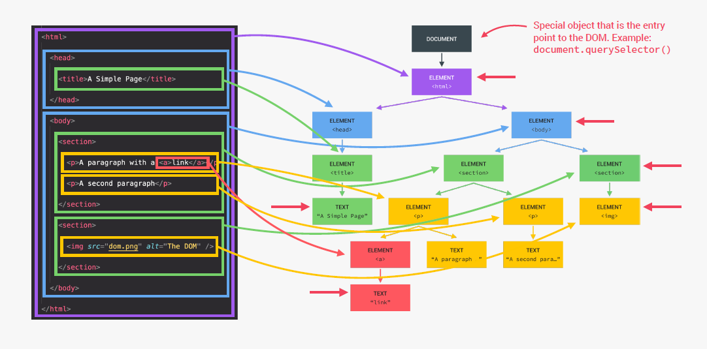

# DOM et Events Fondamentaux

## Table des matières

- [Qu'est ce que le DOM](#quest-ce-que-le-dom)
- [Manipulation des éléments du DOM](#manipulation-des-éléments-du-dom)
  - [Sélectionner un élément](#sélectionner-un-élément)
  - [Sélectionner plusieurs éléments](#sélectionner-plusieurs-éléments)
  - [Obtenir des informations sur les élements](#obtenir-des-informations-sur-les-élements)
  - [Modifier un élément](#modifier-un-élément)
- [Traverser le DOM]()

## Qu'est ce que le DOM

**Le Document Object Model ou DOM (pour modèle objet de document) est une interface de programmation pour les documents HTML, XML et SVG.**

Il fournit une représentation structurée du document sous forme d'un arbre et définit la façon dont la structure peut être manipulée par les programmes, en termes de style et de contenu.

Le DOM représente le document comme un ensemble de nœuds et d'objets possédant des propriétés et des méthodes. Les nœuds peuvent également avoir des gestionnaires d'événements qui se déclenchent lorsqu'un événement se produit. Cela permet de manipuler des pages web grâce à des scripts et/ou des langages de programmation.

## Manipulation des éléments du DOM

### Sélectionner un élément

```js
// Pour sélectionner un élément
document.body; // Récupère l'élément body
document.getElementById("demo"); // Sélectionne l'élément avec l'id demo
document.querySelector(".demo"); // Sélectionne le premier élément correspondant au sélecteur CSS
```

### Sélectionner plusieurs éléments

```js
// Pour sélectionner plusieurs éléments
document.getElementsByClassName("demo"); // Sélectionne les éléments avec la class démo
document.getElementsByTagName("p"); // Sélectionne les éléments <p>
var elements = document.querySelectorAll(".demo"); // Sélectionne les éléments correspondant au sélecteur CSS

// Ces méthodes renvoient un objet NodeList enumerable
// On peut parcourir cette liste d'éléments comme un tableau
for (var i = 0; i < elements.length; ++i) {
  var element = elements[i]; // objet de type Element
}
```

### Obtenir des informations sur les élements

```js
// Pour sélectionner plusieurs éléments
element.getAttribute("attribut"); // Permet de récupérer la valeur d'un attribut
element.style; // Permet de récupérer les styles associés à l'élément
element.classList; // Permet de récupérer la liste des classes associées à un élément
element.offsetHeight; // Donne la hauteur réel de l'élément
```

### Modifier un élément

```js
// Pour sélectionner plusieurs éléments
element.setAttribute("href", "http://github.com");
element.style.fontSize = "24px";
element.classList.add("red"); // Ajoute une class à l'élément
```

## Traverser le DOM

Un document HTML n'est au final qu'un arbre d'éléments HTML et texte qu'il est possible de parcourir de différentes manières. Cet arbre est appellé le DOM.


