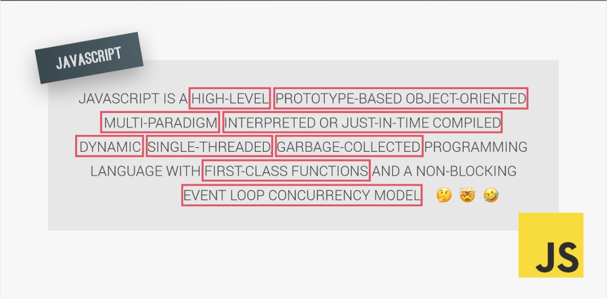
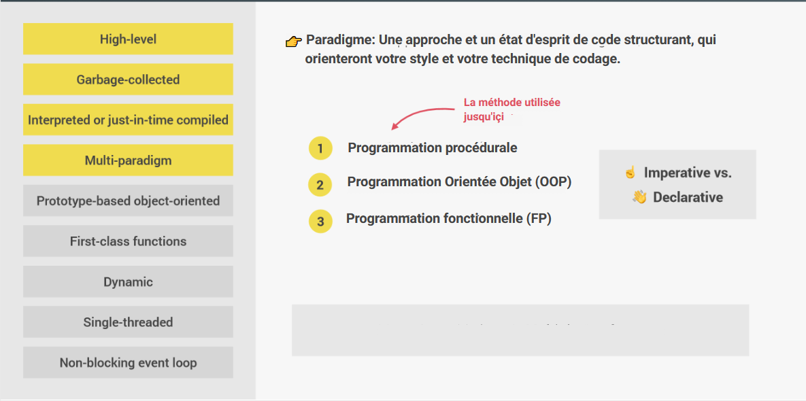
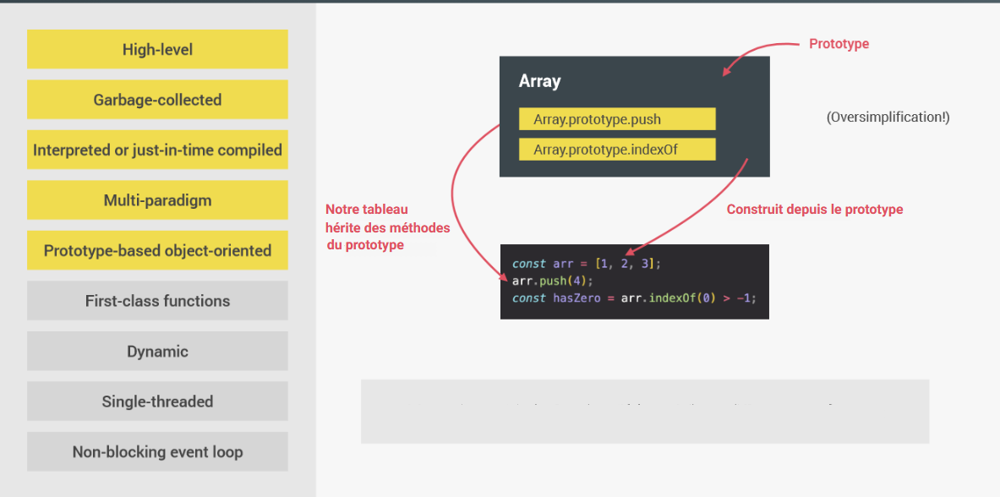
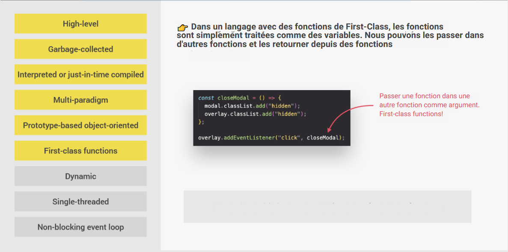

# Dans les coulisses de JavaScript

## Table des matières

- [Qu'est ce que JavaScript]()
  - [High Level]()
  - [Garbage-collected]()
  - [Interpreted ou Just-in-Time Compiled]()
  - [Multi-paradigm]()
  - [Prototype-based / Object Oriented]()
  - [First-class Functions]()
  - [Dynamic]()
  - [Single-threaded]()
  - [Non-blocking Event Loop]()

## Qu'est ce que JavaScript?

JavaScript (souvent abrégé en « JS ») est **un langage de script léger, orienté objet**, principalement connu comme le langage de script des pages web. Mais il est aussi utilisé dans de nombreux environnements extérieurs aux navigateurs web tels que Node.js

> Le code JavaScript est interprété ou compilé à la volée (JustInTime)

> C'est un langage à objets utilisant le concept de prototype

> Disposant d'un typage faible et dynamique qui permet de programmer suivant plusieurs paradigmes de programmation : fonctionnelle, impérative et orientée objet.

### High Level

Tous les programmes informatiques ont besoin de ressources pour fonctionner.
On distingue **les langages Low-level et les High-Level**

- **Low-Level** (C, C++)

  > Les developpeurs doivent gérer manuellement l'allocation des ressources

  > Le langage bas niveau est un programme lisible uniquement par la machine.

  > Difficiles à écrire, à compiler et à déboguer

  > Long à compiler

- **High-Level** (JS, Python )

  > Les développeurs n'ont pas à s'occuper de l'allocation des ressources (automatique)

  > Les langages de haut niveau sont plus proches des langues naturelles, ce qui facilite et vulgarise l'écriture des programmes.

  > Facile à écrire, à compiler et à déboguer.

  > Rapide à compiler

### Garbage-collected

**Un ramasse-miettes (ou récupérateur de mémoire)** est un sous-système informatique de gestion automatique de la mémoire. Il est responsable du recyclage de la mémoire préalablement allouée puis inutilisée.

### Interpreted ou Just-in-Time Compiled

**JavaScript est un langage interprété**, pas un langage compilé.

- **Langage compilé** (C++, Java)

  > Le code source est transmis à un programme appelé compilateur, qui le traduit en bytecode que la machine comprend et peut exécuter.

- **Langage interprété (JavaScript)**

  > Un interpréteur dans le navigateur lit le code JavaScript, interprète chaque ligne et l'exécute.

- **Just in Time Compiled (JS moderne)**
  > Compile JavaScript en bytecode exécutable juste au moment où il est sur le point de s'exécuter.

### Multi-paradigm

### Prototype-based / Object Oriented

### First-class Functions

### Dynamic

### Single-threaded

### Non-blocking Event Loop
