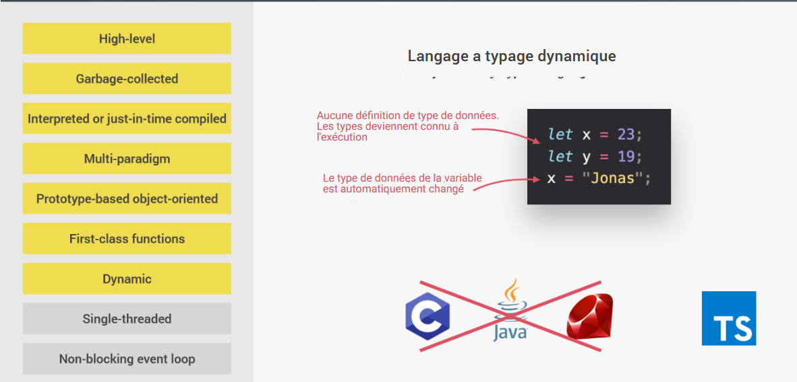
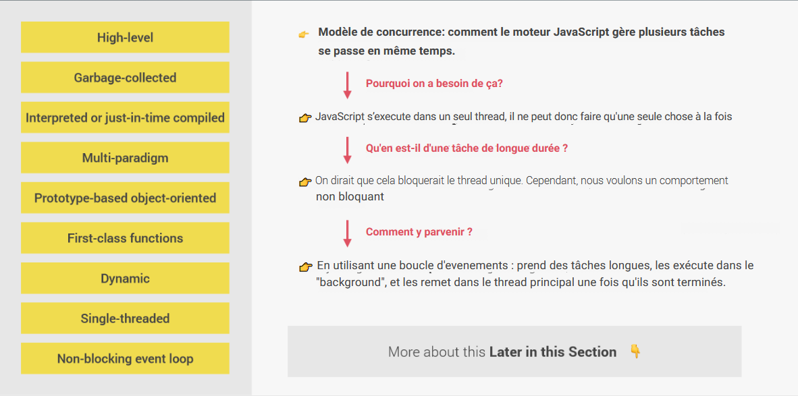
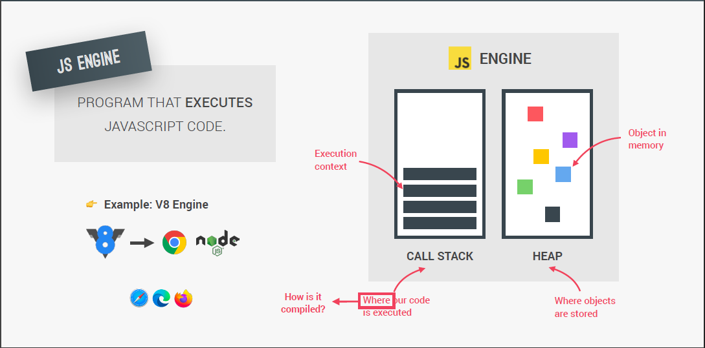
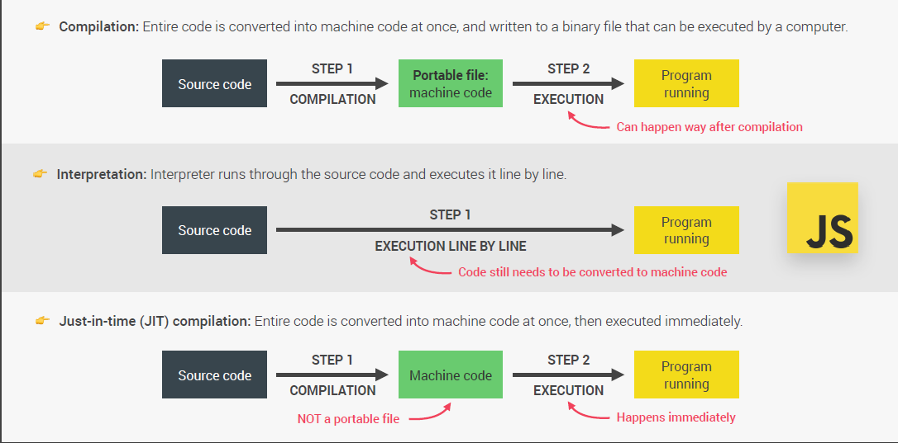

# Dans les coulisses de JavaScript

## Table des matières

- [Qu'est ce que JavaScript](#quest-ce-que-javascript)
  - [High Level](#high-level)
  - [Garbage-collected](#garbage-collected)
  - [Interpreted ou Just-in-Time Compiled](#interpreted-ou-just-in-time-compiled)
  - [Multi-paradigm](#multi-paradigm)
  - [Prototype-based / Object Oriented](#prototype-based--object-oriented)
  - [First-class Functions](#first-class-functions)
  - [Dynamic](#dynamic)
  - [Single-threaded](#single-threaded)
  - [Non-blocking Event Loop](#non-blocking-event-loop)
- [JavaScript Engine]()

## Qu'est ce que JavaScript?

JavaScript (souvent abrégé en « JS ») est **un langage de script léger, orienté objet**, principalement connu comme le langage de script des pages web. Mais il est aussi utilisé dans de nombreux environnements extérieurs aux navigateurs web tels que Node.js

> Le code JavaScript est interprété ou compilé à la volée (JustInTime)

> C'est un langage à objets utilisant le concept de prototype

> Disposant d'un typage faible et dynamique qui permet de programmer suivant plusieurs paradigmes de programmation : fonctionnelle, impérative et orientée objet.

### High Level

Tous les programmes informatiques ont besoin de ressources pour fonctionner.
On distingue **les langages Low-level et les High-Level**

- **Low-Level** (C, C++)

  > Les developpeurs doivent gérer manuellement l'allocation des ressources

  > Le langage bas niveau est un programme lisible uniquement par la machine.

  > Difficiles à écrire, à compiler et à déboguer

  > Long à compiler

- **High-Level** (JS, Python )

  > Les développeurs n'ont pas à s'occuper de l'allocation des ressources (automatique)

  > Les langages de haut niveau sont plus proches des langues naturelles, ce qui facilite et vulgarise l'écriture des programmes.

  > Facile à écrire, à compiler et à déboguer.

  > Rapide à compiler

### Garbage-collected

**Un ramasse-miettes (ou récupérateur de mémoire)** est un sous-système informatique de gestion automatique de la mémoire. Il est responsable du recyclage de la mémoire préalablement allouée puis inutilisée.

### Interpreted ou Just-in-Time Compiled

**JavaScript est un langage interprété**, pas un langage compilé.

- **Langage compilé** (C++, Java)

  > Le code source est transmis à un programme appelé compilateur, qui le traduit en bytecode que la machine comprend et peut exécuter.

- **Langage interprété (JavaScript)**

  > Un interpréteur dans le navigateur lit le code JavaScript, interprète chaque ligne et l'exécute.

- **Just in Time Compiled (JS moderne)**
  > Compile JavaScript en bytecode exécutable juste au moment où il est sur le point de s'exécuter.

### Multi-paradigm

### Prototype-based / Object Oriented

**JavaScript est souvent décrit comme un langage basé sur les prototypes**,chaque objet pouvant avoir un prototype objet d'où il hérite des méthodes et des attributs.

Un prototype peut lui aussi avoir son prototype objet duquel il héritera des méthodes et des attributs et ainsi de suite. On parle alors de chaîne de prototypage

### First-class Functions

### Dynamic

### Single-threaded

**JavaScript est un langage en Single-Thread** (Coeur unique), il ne traite qu'une commande à la fois. L'opposé du Single-Thread est le multithreading.

**Il est également Asynchrone** c'est à dire qu'il utilise une technique qui permet au programme de démarrer une tâche à l'exécution potentiellement longue et, au lieu d'avoir à attendre la fin de la tâche, de pouvoir continuer à réagir aux autres évènements pendant l'exécution de cette tâche. Une fois la tâche terminée, le programme en reçoit le résultat.

**- Avantages de l'approche Asynchrone**

> Pas de limitation due au nombre de threads.
> Pas de locks ou sémaphores.
> Pas de locks gourmants.
> Pas de deadlock.
> Les données ne peuvent pas varier lors de l'exécution d'une fonction synchrone.

### Non-blocking Event Loop

## JavaScript Engine

JS Engine est un programme qui execute le code JS (V8 Engine).

### Compilation vs Interpretation

- Compilation

  > Tout le code est converti en machine code et écrit en fichier binaire qui peut être exécuté par l'ordinateur

- Interpretation

  > L'interpreter traverse le code source et l'exécute ligne par ligne

- Just-in-Time (JIT) Compilation

  > Le code entier est converti en code machine en une seule fois, puis exécuté immédiatement.

