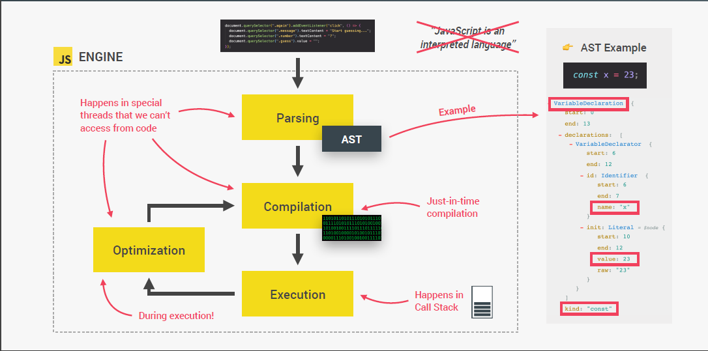
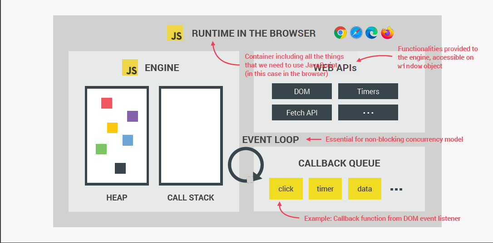
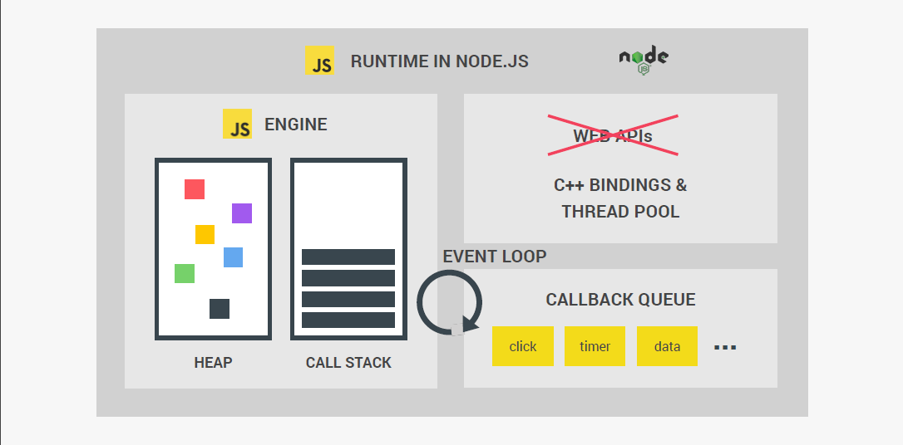
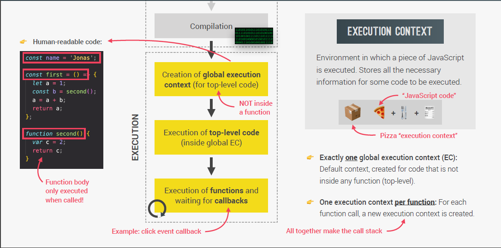
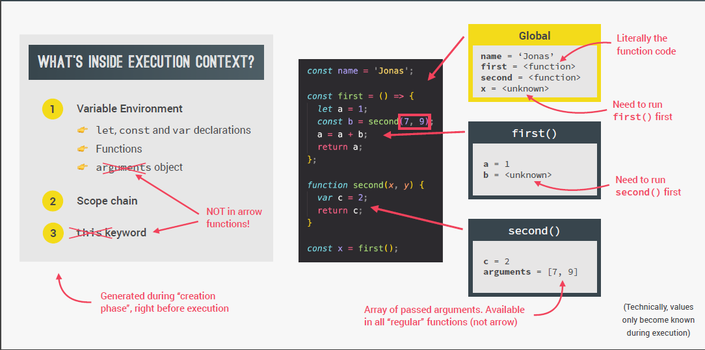
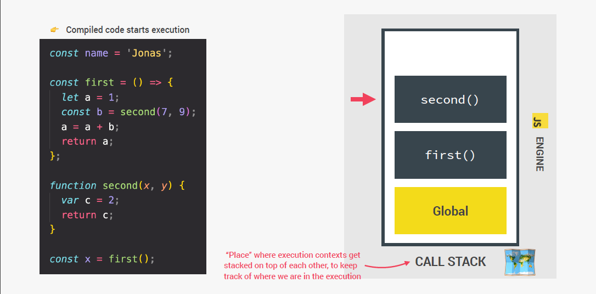
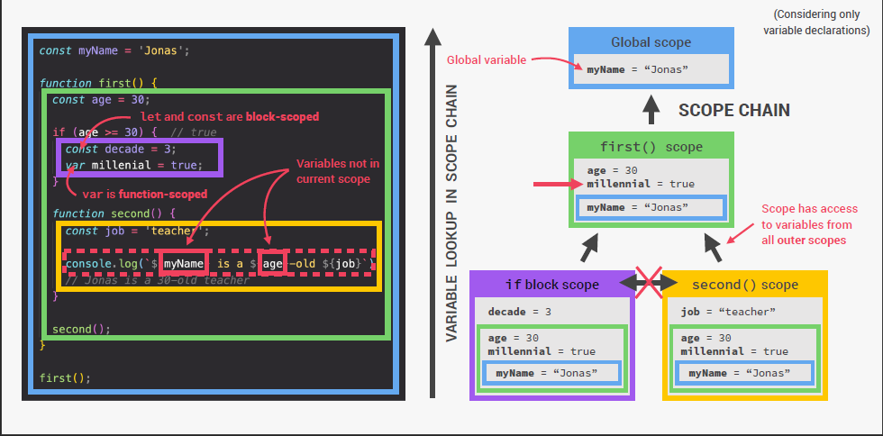
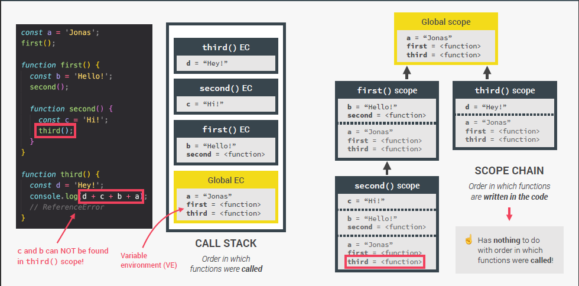

# Dans les coulisses de JavaScript

## Table des matières

- [Qu'est ce que JavaScript](#quest-ce-que-javascript)
  - [High Level](#high-level)
  - [Garbage-collected](#garbage-collected)
  - [Interpreted ou Just-in-Time Compiled](#interpreted-ou-just-in-time-compiled)
  - [Multi-paradigm](#multi-paradigm)
  - [Prototype-based / Object Oriented](#prototype-based--object-oriented)
  - [First-class Functions](#first-class-functions)
  - [Dynamic](#dynamic)
  - [Single-threaded](#single-threaded)
  - [Non-blocking Event Loop](#non-blocking-event-loop)
- [JavaScript Engine](#javascript-engine)
  - [Compilation vs Interpretation](#compilation-vs-interpretation)
  - [Modern Just-in-Time Compilation](#modern-just-in-time-compilation)
- [JavaScript Runtime](#javascript-runtime)
  - [JavaScript Runtime in Browser](#js-runtime-in-browser)
  - [JavaScript Runtime in Node.js](#js-runtime-in-nodejs)
- [Contexte d'exécution et Pile d'exécution]()
  - [Définitions](#définitions)
  - [Le contexte d'exécution](#le-contexte-dexécution)
  - [La pile d'exécution](#la-pile-dexécution)
- [Scope & Scoping in JS](#scope--scoping-in-js)
  - [Concept](#concept)
  - [Les 3 types de Scope (Global, Fonction et Bloc)](#les-3-types-de-scope-global-fonction-et-bloc)
    - [Global Scope](#global-scope)
    - [Fonction Scope](#Fonction-Scope)
    - [Block Scope](#block-scope)

## Qu'est ce que JavaScript?

JavaScript (souvent abrégé en « JS ») est **un langage de script léger, orienté objet**, principalement connu comme le langage de script des pages web. Mais il est aussi utilisé dans de nombreux environnements extérieurs aux navigateurs web tels que Node.js

> Le code JavaScript est interprété ou compilé à la volée (JustInTime)

> C'est un langage à objets utilisant le concept de prototype

> Disposant d'un typage faible et dynamique qui permet de programmer suivant plusieurs paradigmes de programmation : fonctionnelle, impérative et orientée objet.


### High Level

Tous les programmes informatiques ont besoin de ressources pour fonctionner.
On distingue **les langages Low-level et les High-Level**

- **Low-Level** (C, C++)

  > Les developpeurs doivent gérer manuellement l'allocation des ressources

  > Le langage bas niveau est un programme lisible uniquement par la machine.

  > Difficiles à écrire, à compiler et à déboguer

  > Long à compiler

- **High-Level** (JS, Python )

  > Les développeurs n'ont pas à s'occuper de l'allocation des ressources (automatique)

  > Les langages de haut niveau sont plus proches des langues naturelles, ce qui facilite et vulgarise l'écriture des programmes.

  > Facile à écrire, à compiler et à déboguer.

  > Rapide à compiler

### Garbage-collected

**Un ramasse-miettes (ou récupérateur de mémoire)** est un sous-système informatique de gestion automatique de la mémoire. Il est responsable du recyclage de la mémoire préalablement allouée puis inutilisée.

### Interpreted ou Just-in-Time Compiled

**JavaScript est un langage interprété**, pas un langage compilé.

- **Langage compilé** (C++, Java)

  > Le code source est transmis à un programme appelé compilateur, qui le traduit en bytecode que la machine comprend et peut exécuter.

- **Langage interprété (JavaScript)**

  > Un interpréteur dans le navigateur lit le code JavaScript, interprète chaque ligne et l'exécute.

- **Just in Time Compiled (JS moderne)**
  > Compile JavaScript en bytecode exécutable juste au moment où il est sur le point de s'exécuter.

### Multi-paradigm


### Prototype-based / Object Oriented

**JavaScript est souvent décrit comme un langage basé sur les prototypes**,chaque objet pouvant avoir un prototype objet d'où il hérite des méthodes et des attributs.

Un prototype peut lui aussi avoir son prototype objet duquel il héritera des méthodes et des attributs et ainsi de suite. On parle alors de chaîne de prototypage


### First-class Functions


### Dynamic


### Single-threaded

**JavaScript est un langage en Single-Thread** (Coeur unique), il ne traite qu'une commande à la fois. L'opposé du Single-Thread est le multithreading.

**Il est également Asynchrone** c'est à dire qu'il utilise une technique qui permet au programme de démarrer une tâche à l'exécution potentiellement longue et, au lieu d'avoir à attendre la fin de la tâche, de pouvoir continuer à réagir aux autres évènements pendant l'exécution de cette tâche. Une fois la tâche terminée, le programme en reçoit le résultat.

**- Avantages de l'approche Asynchrone**

> Pas de limitation due au nombre de threads.
> Pas de locks ou sémaphores.
> Pas de locks gourmants.
> Pas de deadlock.
> Les données ne peuvent pas varier lors de l'exécution d'une fonction synchrone.

### Non-blocking Event Loop


## JavaScript Engine

JS Engine est un programme qui execute le code JS (V8 Engine).


### Compilation vs Interpretation

- Compilation

  > Tout le code est converti en machine code et écrit en fichier binaire qui peut être exécuté par l'ordinateur.

- Interpretation

  > L'interpreter traverse le code source et l'exécute ligne par ligne.

- Just-in-Time (JIT) Compilation

  > Le code entier est converti en code machine en une seule fois, puis exécuté immédiatement.


### Modern Just-in-Time Compilation



## JavaScript Runtime

Un environnement d'exécution ou runtime est un logiciel responsable de l'exécution des programmes informatiques écrits dans un langage de programmation donné1. Un runtime offre des services d'exécution de programmes

### JS Runtime in Browser



### JS Runtime in Node.js



## Contexte d'exécution et Pile d'exécution

### Définitions

- Contexte d'exécution

> Un contexte d'exécution (en anglais, execution context) d'une tâche (processus, processus léger...) est constitué par l'ensemble des données utilisées par la tâche en question.C'est l'ensemble minimal de données à sauvegarder pour permettre une interruption de la tâche à un moment donné, et une reprise de cette exécution au point où elle a été interrompue, et, dans la mesure du possible, indépendamment de la date de la reprise du processus.

- Pile d'exécution

> La pile d’exécution (en anglais, call stack) est une structure de données de type pile qui sert à enregistrer des informations au sujet des fonctions actives dans un programme informatique. Une pile d'exécution est utilisée pour emmagasiner plusieurs valeurs, mais sa principale utilisation est de garder la trace de l'endroit où chaque fonction active doit retourner à la fin de son exécution (les fonctions actives sont celles qui ont été appelées, mais n’ont pas encore terminé leur exécution)

### Le contexte d'exécution





### La pile d'exécution



## Scope & Scoping in JS

### Concept

- 👉 **Scoping**: Comment les variables de notre programme sont **organisées** et **accessibles**. "Où les se trouvent les variables?" ou "Où pouvons-nous accéder à une certaine variable, et où pas ?"

- 👉 **Lexical scoping**: La portée (Scope) est contrôlée par le **placement** des fonctions et des blocs dans le code ;

- 👉 **Scope**: espace ou environnement dans lequel une certaine variable **est déclarée** (variable d'environnement en cas de fonctions). Il existe une **portée globale**, une **portée de fonction** et une **portée de bloc** ;

- 👉 **Scope of a variable**: Région de notre code où une certaine variable est **accessible.**

### Les 3 types de Scope (Global, Fonction et Block)

#### Global Scope

> 👉 En dehors de toute fonction ou bloc.

> 👉 Variables déclarées en global portée sont **accessibles partout**.

```js
const me = "Mathys";
const job = "Développeur";
const year = 1997;
```

#### Fonction Scope

> 👉 Les variables ne sont accessibles qu'**à l'intérieur de la fonction** pas à l'extérieur

> 👉 Aussi appelé "**Local Scope**"

```js
function calcAge(anneeNaissance) {
  const annee = 2022;
  const age = annee - anneeNaissance;
  return age;
}

console.log(annee); // ReferenceError
```

#### Block Scope

> 👉 Les variables ne sont accessibles qu'à l'intérieur du bloc (**Block Scoped**)

> 👉 Ne s'applique qu'aux variables déclarées par **let** et **const**

> 👉 Les functions sont aussi Block Scoped (en strict mode)

```js
if (year >= 1969 && year <= 1997) {
  const millenial = true;
  let food = "Un avocat au surimi";
}

console.log(millenial); // ReferenceError
console.log(food); // ReferenceError
```

### Scope Chains

#### Définition

- Scope Chains
  > Lorsqu'une variable est utilisée en JavaScript, le moteur JavaScript essaie de trouver la valeur de la variable dans la portée actuelle. S'il n'a pas pu trouver la variable, il examinera la portée externe et continuera à le faire jusqu'à ce qu'il trouve la variable ou atteigne la portée globale.



### Scope Chains vs CallStack

- **CallStack**

  > le code s'exécute dans l'ordre dans lequel les fonctions sont appelées.
  > Exécute les variables et les fonctions dans l'ordre dans lequel elles sont appelées.

- **Scope Chains**

  > Le code s'exécute dans l'ordre dans lequel les fonctions sont écrites lexicalement
  > Permet à certaines fonctions d'accéder à des morceaux de code dans lesquels elles sont écrites lexicalement


